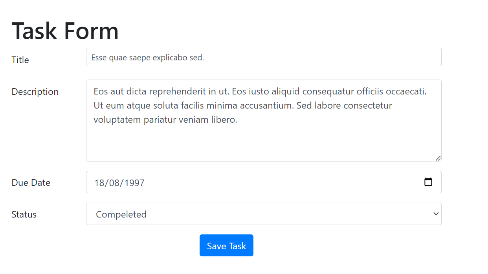
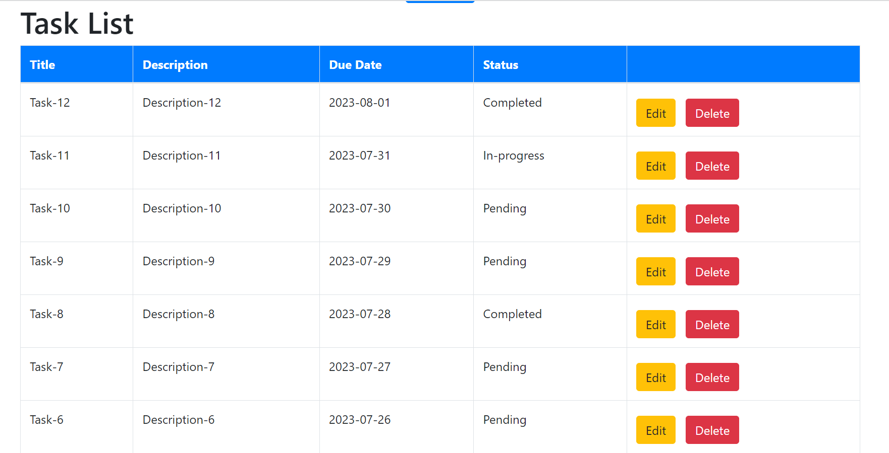

# Task Management Web Application

The Task Management Web Application is a simple web-based task management system built with Laravel and Vue.js. It allows to manage their tasks by adding, viewing, updating, and deleting tasks.





## Table of Contents

- [Installation](#installation)
- [Features](#features)
- [Running the Application](#running-the-application)
- [Running Database Seed](#running-db-seed)
- [Running Unit Tests](#running-unit-tests)
- [API Endpoints](#api-endpoints)

## Installation

1. Clone the repository:

```bash
git clone https://github.com/iqra-khan0635/laravel-vue-task-crud.git
cd laravel-vue-task-crud
```

2. Install the PHP and JavaScript dependencies:

``` bash
composer install
npm install
```

3. Create a copy of the .env.example file and rename it to .env:

```bash
cp .env.example .env
```

4. Generate the application key:

```bash 
php artisan key:generate
```

# Features

- View all tasks in the system, showing their titles description, due dates and status.
- Add new tasks with title, description, and due date fields.
- Update existing tasks directly from the front end.
- Delete tasks from the system.

# Running the Application

To start the development server, run the following command:

```bash
npm run dev
php artisan serve
```
   
The application will be accessible at http://localhost:8000 in your web browser.

# Running DB Seed

To execute the seed, use the following command:

```bash
php artisan db:seed
```

# Running Unit Tests

To execute the unit tests, use the following command:

```bash
php artisan test
```
The tests will run, and you should see the output indicating if they passed or failed.

# API Endpoints

The application exposes the following API endpoints for managing tasks:

- `GET /api/tasks`: Fetches a list of all tasks.
- `POST /api/tasks`: Creates a new task. Payload should contain **title**, **description**, **due_date**, and **status**.
- `GET /api/tasks/{id}`: Fetches a single task by its ID.
- `PUT /api/tasks/{id}`: Updates an existing task. Payload should contain **title**, **description**, **due_date**, and **status**.
- `DELETE /api/tasks/{id}`: Deletes a task by its ID.


